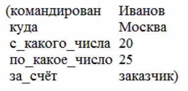
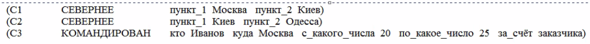
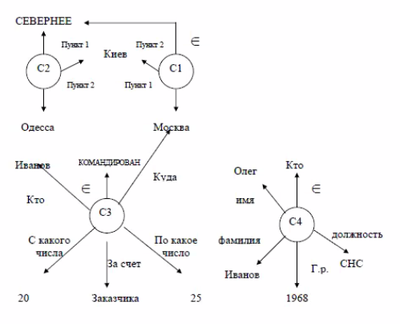
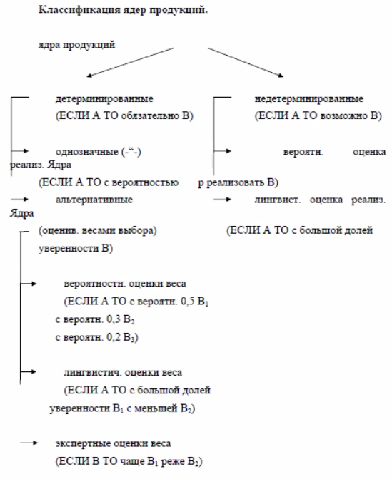
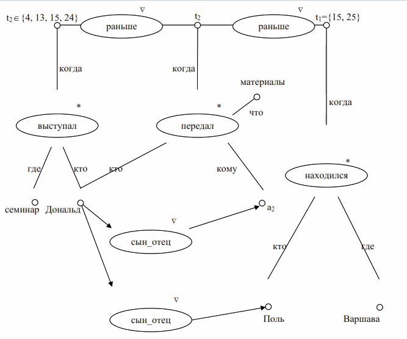
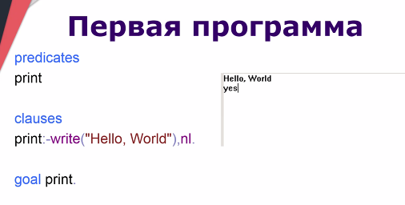
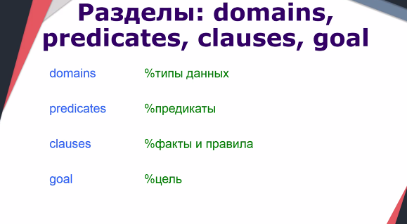
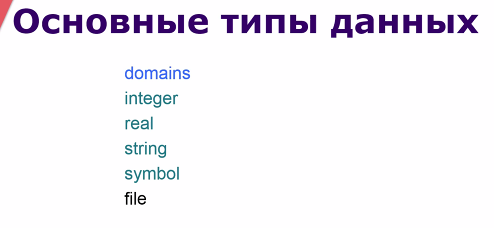
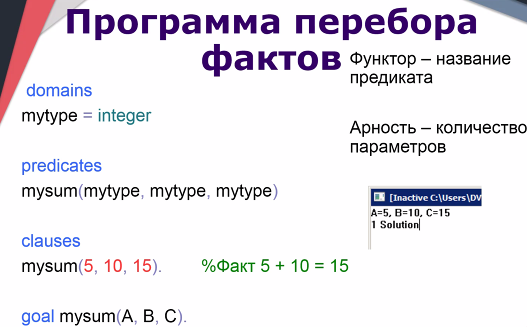
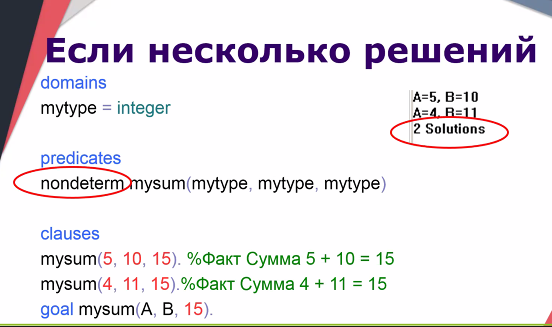

# Интеллектуальные системы и технологии

## Базовые понятия искусственного интеллекта

Цель: подготовка специалистов в области автоматизации сложно формализуемых задач 

Предмет: мыслительные способности человека и способы их реализации техническими средствами

Определения **искусственного интеллекта**:

1. Искусственный интеллект (intellectus - ум, рассудок...) - свойство автоматических систем брать на себя отдельные функции интеллекта человека

2. Способность решать интеллектуальные задачи (из этапов решения: приобретение знаний, запоминание, целенаправленное преобразование полученных знаний)

3. Универсальный сверхалгоритм, способный создавать алгоритмы решения конкретных задач

4. (Колмагоров) любая материальная система, с которой можно достаточно долго обсуждать проблемы науки, литературы и искусства, обладает интеллектом

5. (Тьюринг) в двух комнатах человек или машина с интеллектом, если через интерфейс общения с ними в процессе диалога не могут определить с кем общаются, то машина с интеллектом или люди без интеллекта

Сложнейший вопрос для человека - насколько влияет окр. среда и генетическая предрасположенность, то же и для ? - что есть изначально в нейронке и как она обучается для конкретной задачи

**Знание** - внутренняя структура, которая устоялось у человека после внешнего воздействия

**Алгоритм** - 

В кибернетике задача решена, если для её решения существует алгоритм

**Интеллектуальные задачи** - задачи, связанные с поиском алгоритма решения класса задач -> у которых есть алгоритм - не интеллектуальные

Свойства ИИ:

- Способность к обобщению

- Рассуждения по аналогии

- Адаптация к изменяющимся условиям

План имитации Тьюринга - если хотим имитировать мышление взрослого человека, то по порядку имитации мышления ребёнка, а после обучить до получения

## История интеллектуальных систем

Ключевые слова:
ЭС — экспертная система
БЗ — база знаний
ИЕ — информационная единица

первая система в направлении:

- gps — general purpose solver — решатель для головоломок —> экспертные системы — принятие решений на основе двух частей:
1. ...
2. любое решение принимается на основе сенсоров и внутренних знаний.

### Dendral

первая экспертная система — Dendral - хим. анализ.
3 этапа работы:

1. в любой экспертной системе должна быть база знаний. Здесь из базы знаний берется список исходных условий. Попытаться 
   сформулировать постановку задачи в терминах базы знаний ЭС.
2. С помощью эксперта дополнить задачу исходными условиями. Возможны 2 варианта:
   - условия автоматом попадают в базу знаний — ЭС.
   - данные, которые не попадают и будут присутствовать при решении моей задачи, это зависит от квалификации эксперта.
3. генерация и ранжирование возможных решений.
   В рамках тех условий, которые вытащены из БЗ - перебор вариантов - вывод решений. 
   Ранг — степень достоверности, предполагающая, что чем выше ранг, тем более достоверное решение.
   Решение не было вероятностным.

### MyCin

Второй пример экспетной системы — myCin автор шортклиф 1976 год.
Медицинская экспертная система. Занимается диагностикой заболеваний крови.
Всегда решение было вероятностным — чтобы защититься от суда.

Лучше обходиться без нейронок, если есть варианты без них обойтись, так как мы не знаем, как работают нейронные сети.
Нейронная сеть не может объяснить, почему она приняла то или иное решение.
А экспертная система знает, почему она приняла то или иное решение и может объяснить это по шагам.

### AM & Eurisco стэнфорд

AM — 100 правил вывода и 200 эвристик, экспертная система. Предполагается, что этим набором знаний обладает 4-хлетний ребенок.
Она генерировала, генерировала решения и потом через какое-то время она не смогла генерировать новое решение и её развитие остановилось.

Eurisco — примерно те же исходные данные, что и в AM, но с маленькой добавкой: в неё добавили мутации. Т.е. разрешили ей генерировать новые правила с некой случайной добавкой, предполагая, что эта добавка изначально приведет к новому решению? ... Эта система могла изменить исходные правила для решения исходной задачи.

Эту систему применяли успешно 3 года в управлении военного флота штатов. Через некоторое время начали возникать коллизии из-за изменения исходных условий и её перестали использовать.

## Особенности знаний

### Внутренняя интерпретируемость

у любой инф. единицы должен быть идентификатор (имя или номер), по которому её можно отличать от другой информационной единицы. Например, чем отличается апельсин от огурца.

### Структурированность

Данные не должны лежать скопом. Знания должны быть структурированные: одни данные должны быть вложены в другие. Проще искать данные в отсортированном массиве, чем не в отсортированном.
Ассоциация: знание в ящичке в коробочке на полочке и по этому порядку его легко найти.

### Связность

ИЕ не могут находиться в вакууме. Типы связей могут носить декларативный характер и процедурный.
Декларативный характер — причины и следствия. Причина знаний — я готовился к экзамену. Следствие — я получил пятерку.
Процедурные знания — функция. Есть аргумент и есть математические вычисления.

Отношения между нейронными единицами:

1. Отношение структуризации — задаем иерархию единиц. Кто-то главный, кто-то под ним.
2. Функциональные отношения — когда одни инф единицы вычисляются через другие.
3. Каузальные — причинно-следственные, cause.
4. Семантические отношения — отношения, которые не удается квалифицировать к предыдущим трём. semantic ~ осмысленные.

Семантическая сеть — это иерархическая сеть. В вершинах находятся ИЕ. У них уникальные имена. Между этими ИЕ есть связи *разных* типов.

### семантическая метрика.

Это какое-то число, которое характеризует ситуационную близость ИЕ — насколько единицы близки друг к другу.

Сила ассоциативной связи между информационными единицами позволяет выделить в инф базе типовые ситуации. ПО сути мы находим знания близкие среди найденных.
например
5 × 5 = 25
6 × 6 = 36
7 × 7 = 47

/* способ прекратить опоздания — создать время, когда двери закрываются и проходить можно только через кабинет директора. */

### Активность

отличие бз от бд — в том, что в бд знания просто хранятся, а в бз возможны любые активности, потому что знания активные.
Например, если создать запись в бд, то просто появляется новая запись. Если создать запись в бз, то могут появиться новые таблицы, что никак не вписывается в понимание баз данных.

Пример:
Количество учащихся может повлиять на запуск листочка с посещенными.

## Модели представления знаний

Классификация моделей обусловлена типами связей.
Модели бывают либо декларативными, либо процедуральными.

И у тех и у других есть свои плюсы и минусы.
В процедуральных в основе некоторые процедуры — математика.
Декларативные — набор фактов, которые перебираются.

/* хохма про измерения мячика физиком, математиком и программистом. ПРограммист ищет объем мячика в справочнике по мячикам. */

/* пример про вычисление интеграла. Процедурный подход к вычислению интеграла — использовать формулы для его вычисления. Декларативный — использовать площадь под фигурой. */

## Особенности декларативной модели и концептуальной

В декларативной почти отсуствуют какие-то процедуры и функции. В ней только есть набор фактов и механизм вывода. по сути поиск в пространстве состояний.
процедуральное — набор процедур и функций. Фактов меньше, но к ним применяются механизмы вывода с помощью процедур.

### Расширенная и классические модели вывода

В процедуральной модели существуют две формулы вывода.

Классическая формула вывода: А -> Б
Если А и нет фактов против Б, то предположить Б.

Расширенная формула вывода:
Когда нет однозначного следствия из А в Б и отсуствует коллизия из А в Б, то можно предположить наличие факта.
Другими словами: Если А — истина и нет доказательств против B, то предположить B.

Расширенные выводы полезны в двух случаях:

2. когда есть недостаток знаний для принятия точного решения. Поэтому дополняем фактами, которые не противоречат решению и получаем решение. Если получаем противоречие в решении, то откатываемся и убираем факт, который вызвал коллизию.
   2. Когда ограниченный ресурс.

### Способы описания знаний:

#### 1. Логическая модель

В основе лежит формальное описание $M = <T, P, A, B>$, где 

$T$ - множество базовых элементов (слова из какого-нибудь словаря), причём всегда есть процедура проверки, по которой можно определить принадлежит ли произвольный элемент этому множеству. Процедура может быть любой сложности, но должна выдавать ответ за конечное число шагов.

$P$ - множество синтаксических правил, с помощью этого множества из множества базовых элементов можно сформировать с помощью синтаксических правил синтаксическую правильную совокупность. Есть некая процедура (процедура проверки), посредством которой за конечное число шагов можно определить, является ли совокупность синтаксически правильной.

(Основа любой интеллектуальной системы основывается на этих множествах)

$A$ - множество аксиом - наиболее критичных для нас синтаксически правильных конструкций в системе. Также есть процедура ...

$B$ - Правила вывода. Элементы этого множества можно применять к элементам аксиом. Для получения новых аксиом. **Если имеется процедура, с помощью которой можно определить для любой синтаксически правильной совокупность, является ли она выводимой, то соответствующая формальная система является разрешимой.** Тобишь, если есть такая процедура, то можно для любой требуемой настройки через конечное число шагов определить, возможно ли её удовлетворить. Однако правила вывода могут генерировать бесконечное число решений.

Модель - классическое представление мат. логики с добавлением логики предикатов (кванторов)

**Предикат** - логическая функция, заданная на термах и принимающая значение истина или ложь.

Основной недостаток модели - ограниченная выразимость

Пути преодоления недостатков:

1. Расширение и модификация логики предикатов
   
   1. Ограничение законов мат. логики семантическим правилом (вероятность булевого)

2. Разработка глобальных механизмов представления - маленькие модели группируем в глобальные системы

Плюсы логики предикатов:

- Жёсткая формальная система

- Предсказуемость

Экспертные системы могут объяснять решения, в отличии от нейронок.

#### 2. Сетевая модель

Похожа на граф

$H=<I,C_1,C_2, ..., C_n, Г>$

$I$ - множество информационных единиц - вершины графа

$C_1,C_2, ..., C_n$ - типы связей между информационными единицами

При таком подходе графы обычно отображаются в слоистой структуре

$Г$ - отображение типов связей между информационными единицами - дуги соответствующего типа (соединяет вершины и имеет тип)

В зависимости от типа связи сети могут быть следующих видов:

1. Классифицирующие

2. Функциональные (когда одна инф. единица вычисляется через другую)

3. Сценарии - каузальные (причинно-следственные) отношения

Некоторые понятия сетевой модели:

- П-объект - который существует в реальном мире

- М-объект - описание реального объекта в модели

При описании реальности каждому П будет соответствовать М

Могут существовать М, для которых нет П (неворующий чиновник), может быть и наоборот (мы просто М не указываем в базе знаний)

Способ интерпретации взаимосвязаны П-объектов - денотативная семантика

А для интерпретации М - коннотативная семантика

Терминальный объект в модели - М-объект, который не может быть разложен на более простые модели

Отличие сетевой модели в базе знаний от других сетевых моделей - СМ-фрейм

Высказывание: 20-25 числах Иванов был командирован в Москву за счёт заказчика

Описание в виде сетевой модели СМ-фреймов (но не хватает id):



> Уникальная идентификация информационных единиц как одно из условий базы знаний

Другой способ описания:



Итоговая визуализация фреймов:



Когда модели становятся большими, то может быть группировка, схлопывание, противоречие данных

Десигнаты - сущности

Желательно, чтобы разрывов в сетевой модели не было

Связи между фреймами (метками) организуются через сущности

#### 3. Продукционные модель

Продукция - правило вывода

**Данная модель - гибрид сетевой модели (семантическая сеть) с правилами вывода**

В зависимости от правил вывода может меняться архитектура графа (системы)

#### 4. Фреймовая модель

Фрейм - структура, в которой есть нечто

```
Имя фрейма:
Имя слота 1 (значение слота 1)
...
Имя слота n (значение слота n)
```

Значение - всё, что угодно, в том числе фрейм или набор слотов более низкого уровня

Если все значения слотов получены, то имеем конкретный фрейм (фрейм - экземпляр, факт), если нет - неконкретный

При формировании предикатов не советуется большое количество аргументов.

**Факт** - фрейм, у которого значение всех аттриботов являются терминальными объектами

**Ситуация** - выделенная в соответствии с определённым принципом совокупность фреймов

Коллизии избыточности возможны, если все данные внедрить в одну ситуацию

## Статусы и логическая структура МПОБ

МПОБ - модель предметной области

Факты могут иметь разные статусы истинности

Замкнутая база знаний - если факт присутствует в базе - истинные, если нет - ложный
например, авиарейсы, билеты ...

Открытая модель добавляет к бинарной системе ещё статус 'неопределён'

**Процедура ассимиляции** - соотносит синтаксически правильные фреймы с **дедуктивным замыканием модели** (модель, дополненная всеми её **виртуальными утверждениями** (те, что можно получить с помощью правил вывода))

Она позволяет проверить текущее состояние в базе знаний на противоречивость. Ресурсозатратна, но необходимо при изменении фактов.

## Понятие экстенисонала и интесионал

Экстенисонал - конкретный факт - 7 х 8 = 56 = true, 7 x 8 = 57 = false...

Интесионал - функция, генерирующая множество фактов из любого сочетания аргументов

Для нетривиальных задач вывести функцию не всегда получается, в определённых ситуациях пользоваться набором фактов быстрее

## Таксономические структуры (ТС) в сетевых моделях

Простейший пример - иерархия классов

Таксономические структуры - иерархия абстрактных понятий, имеющие структуру дерева, корень которого представляет наиболее общее понятие, а остальные вершины - более частные понятия

Корень - общее, лист - частное, ветви - вопросы, по которым конкретезируется факт

ТС помогает ИИ рассуждать по аналогии - если на одном уровне ТС, то высока вероятность схожести фактов, построить гипотезы о свойствах

Недостатки ТС:

- Вопрос - по каким принципам строить структуру

- Мультиерархия - усложнение задачи при множественном наследовании

> 5 ЛК (28/10/2021)

## Продукционные модели

Продукция - $(i); Q;P; A->B;N$

(i) - имя продукции - отражает суть продукции - отображает семантический смысл, мб порядковым номером

Q - сфера применения продукции чтобы можно было структурировать знания

P - условие применимости ядра продукции - условие, булевый предикат

A -> B - секвенция, ядро продукции (если А, то В), мб альтернативы $B_2, ...$

> Из отрицания условия нельзя делать выводов о следствии

N - постусловие продукции, активизируется после реализации B

Выполнение N может быть с задержкой от B, поэтому пишутся отдельно в формуле

Разница между актуализацией и оптимизацией (активизацией?)

Актуализация продукции - для выполнения продукции выполнены все необходимые предусловия

### Классификация ядер продукции



### Управление системой продукций

В каждый момент времени мб актуальной целая группа продукций

Фронт готовых продукций - набор продукций, для которых в данный момент времени выполняются условия применимости

Пути решения задачи управления:

- Централизованный - решения принимаются "сверху"

- Децентрализованный - исходя из сложившейся ситуации на текущий момент

- Гибридное - в зависимости от штатности ситуации

Принципы:

- Стопки книг - наиболее часто используемая продукция является наиболее полезной, но есть ещё обучающая процедура, не просто сортировка. Стоит применять, если продукции независимы.

- Принцип наиболее длинного условия - статистика условий выполнимости - чем больше выполнено, тем более ценна продукция - более конкретное знание получаем. Стоит применять, если есть структура по типовым ситуациям.

- Метапродукций - в систему добалвяются специальные метапродукции, которые организуют управление из фронта готовых продукций

- Классной доски - в ОЗ выделяется динамическая область n*m, в которой выделяются поля, в которых прописывается необходимость продукций для выполнения продукций.

- Приоритетного выбора - вводятся приоритеты на продукции (статические - на знаниях экспертов, динамические - в процессе работы системы)

- Управление по именам - для готовых продукций задаётся формальная грамматика

## Сценарии

Для знаний нужны стериотипные знания - когда мы можем выделить в ситуациях реального мира типовые паттерны развития событий

Сценарий - формализованное описание стандартной последовательности взаимосвязанных фактов, определяющих типичную ситуацию предметной области

Это мб последовательности действий или процедур, описывающие способы достижения целей действующих лиц сценария

Сценарий в виде дерева - для построения описывается конечная цель

Каузальные сценарии - последовательность действий в виде фрейма - имя слота (кто выполняет действие), значение - реализация

имя слова 1 (значение слота 1);

## Ленемы

> В интеллектуальных системах могут использоваться сразу несколько моделей представления знаний

> Конфликт между разработчиком и пользователем
> Разработчику важно ТЗ, он пытается подогнать под пользователя имеющиеся инструменты разработки
> Пользователь же хочет удобства

Двухуровневая система:

1. Язык спецификации (L-язык)

2. Базовая формальная система (БФС)

Смысл L-языка описывается в терминах базовой формальной системы. В основе лежит **ленема** - конструкция, задающая схему описания понятий

Спецификация модели предметной области есть только на уровне пользователя. Сам пользователь пишет спецификации на L-языке.

Разработчик работает на уровне БФС.

БФС состоит из:

- Библиотеки понятий - содержит описание классов объектов
  
  - Декларативный - обозначение понятий
  
  - Интерпретационный (необязательно) - интерпретация понятия в системе

- Функциональная семантическая сеть (ФС-сеть) - гибрид, объединяющий возможности семантической и функциональной сетей. Вершины могут быть разного типа (объект, функция, отношение). Дуги отражают связи функций с аргументами. Значения могут быть скорректированы. ФС-сеть оптимизируется.
  
  - Объектные вершины имеют два уровня
    
    - Декларативный - привязка класса объекта
    
    - Интерпретационный - привязка значения или множества значений
  
  - Функциональная вершина - обладает собственной активностью

- Продукционная система над ФС-сетью. Продукция отражает свойство отношения порядка между точками на прямой - расстояния между вершинами. Этапы работы продукций:
  
  - Проверяется условие выполнимости
  
  - Вычислить тело продукций
  
  - Выполнить пост-условие



L-язык - надстройка над базовой формальной системой.

Типы ленем, которые должен использовать пользователь при написании спецификаций:

- Для описания класса объекта

- Для отношений

- Для функций

## Prolog

5.2

ikasteko

http://www.ikasteko.ru/page/visual_prolog_5_2_free_download

Можно подсвечивать в notepad++



В предикатах нет точки





integet\* - список





nondeterm - могут быть множественные решения
